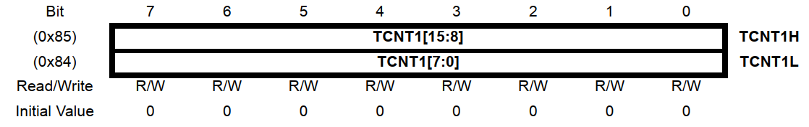
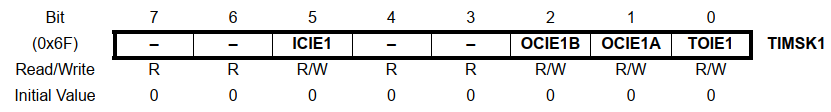
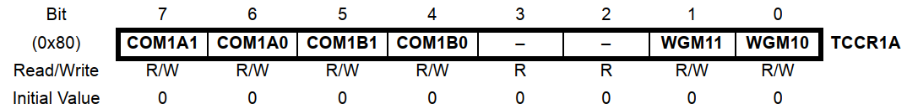
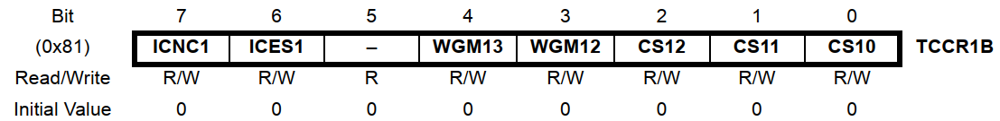
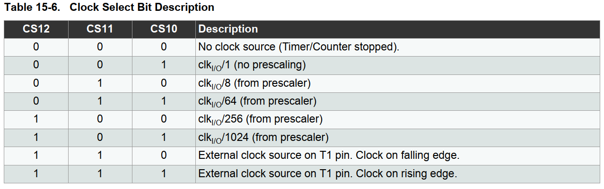

# Blink LED using Overflow Interrupt
### Prerequisite
1. Hardware: Arduino Uno
2. Software: Install AVR GCC Toolchain (Please follow instructions in README.md of master branch if not already done)

### Objective
1. Blink built-in LED driven by digital pin 13
2. Use 16-bit Timer to generate interrupt after every 1sec

### Learnings
1. **F_CPU** only tells the compiler what CPU speed to use for various delays and functions. It does not change the CPU clock frequency.
2. **TCNT1** is a 16-bit register. It is composed of two parts
	* TCNT1H which holds upper 8bits.
	* TCNT1L which holds lower 8bits.
	* When TCNT1 receives its driving clock from internal oscillator, it is called Timer-1.
	* When TCNT1 receives its driving clock from external source, it is called Counter-1.

2. **TIMSK1** is interrupt mask register. Please read 15.11.8 section in datasheet to learn more.
   - In program, we have used **TOIE1** which is overflow interrupt enable bit.

3. **TCCR1A** is Timer/Counter control register A. It is used to set normal port operations. Please refer 15.11.1 section of datasheet to know more.

4. **TCCR1B** is Timer/Counter control register B.

   * The bits [2:0] are known as clock select bits. In the program, we have used value of 101B that increments TCNT1 register in every 1024 clocks.
	
   *  Please refer 15.11.2 section in datasheet to know more about this register.

### Pin-out diagram of Arduino Uno

> Note: Please run `avr-devEnv` in your cmd before running Makefile

> Note: Please change the port number in Makefile as applicable to your system
### Reference
1. [Atmega328P datasheet](https://ww1.microchip.com/downloads/en/DeviceDoc/Atmel-7810-Automotive-Microcontrollers-ATmega328P_Datasheet.pdf)
2. [Timer/Counter Module of Atmega328P Module](https://forum.arduino.cc/t/ch-9-timer-counter-module-of-atmega328p-mcu/662590)
3. [Atmega Interrupts](https://www.arxterra.com/10-atmega328p-interrupts/)