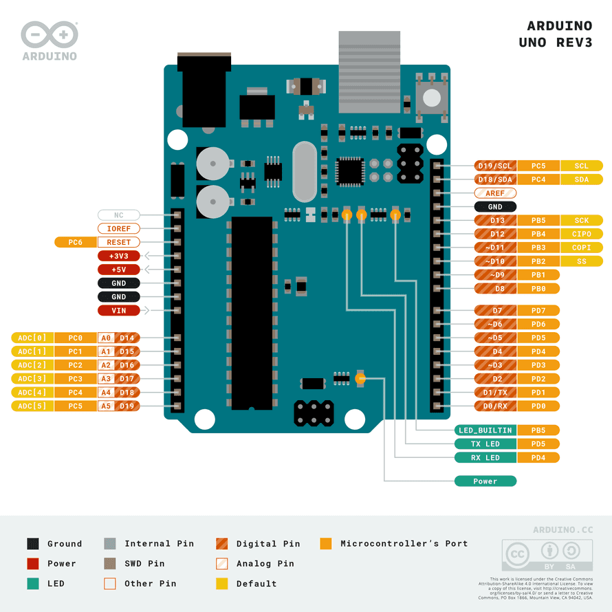

# Blink LED
### Prerequisite
1. Hardware: Arduino Uno
2. Software: Install AVR GCC Toolchain (Please follow instructions in README.md of master branch if not already done)

### Objective
1. Blink built-in LED driven by digital pin 13
2. Insert delay in program

### Pin-out diagram of Arduino Uno

> Note: Please run `avr-devEnv` in your cmd before running Makefile

> Note: Please change the port number in Makefile as applicable to your system
### Reference
1. [Atmega328P datasheet](https://ww1.microchip.com/downloads/en/DeviceDoc/Atmel-7810-Automotive-Microcontrollers-ATmega328P_Datasheet.pdf)