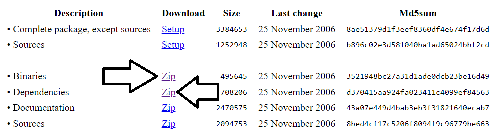
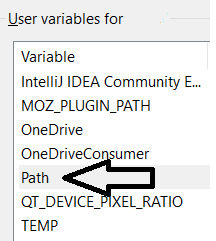

# Baremetal Arduino C Programming in Windows
## Install AVR toolchain
The **AVR GCC Toolchain** is a collection of tools and libraries used to compile your code for the AVR microcontrollers. This collection includes a compiler, assembler, linker, and some libraries.

To setup and use AVR GCC Toolchain we need 3 essential components:

1. AVR GCC – Windows Binary
2. GNU Make – on Windows
3. AVRDUDE – on Windows

Please follow each section to install required packages. We will create a batch script to start development environment for a particular cmd session. Create a **Programs** folder inside *C:\Users\MY_USER_NAME* before moving to next section.

> Note: Don’t forget to replace MY_USER_NAME with your username
### AVR GCC
1. Download GCC compiler for AVR microcontrollers from [Microchip](https://www.microchip.com/en-us/tools-resources/develop/microchip-studio/gcc-compilers/) website.
2. From website, look for "AVR 8-Bit Toolchain (Windows)" or similar.
3. Extract the ZIP file in the “Programs” folder (location: *C:\Users\MY_USER_NAME*). All the folders and files should be in an “avr8-gnu-toolchain-3.7.0.1796-win32.any.x86_64” folder. Let’s rename that to “avr8-gnu-toolchain”.

### GNU Make on Windows
In the “Programs” folder, create a “gnuwin32” sub-folder for the gnuwin32 packages. Download the Make packages from this [link](https://gnuwin32.sourceforge.net/packages/make.htm).

1. Locate the Binaries ZIP file “make-3.81-bin.zip” and extract the contents in the gnuwin32 folder. The sub-folders and files should look like: bin, contrib, man, manifest, share.
2. Also download Dependencies ZIP file “make-3.81-dep.zip” from the same page and extract them at the gnuwin32 folder.



### AVRDUDE on Windows
When we start compiling our programs and packaging them as HEX files, we are going to need a program to upload them to the microcontroller. One such and very popular program is the AVRDUDE.

1. In the “Programs” folder create an “avrdude-mingw32” sub-folder for the AVRDUDE package.
2. Download the AVRDUDE package from this [link](https://download.savannah.gnu.org/releases/avrdude/avrdude-6.4-mingw32.zip)
3. Locate the Binaries ZIP file. This should be something like “avrdude-6.4-mingw32.zip”.
4. Extract the contents in the avrdude-mingw32 folder.

### Batch script to activate development environment
1. Create an "alias" subfolder inside “Programs” folder.
2. Create a file with name avr-devEnv.bat inside "alias" subfolder.
3. Copy and paste below content in the avr-devEnv.bat and save it.
```
@echo off
set Path=%Path%;C:\Users\MY_USER_NAME\Programs\avr8-gnu-toolchain\bin
set Path=%Path%;C:\Users\MY_USER_NAME\Programs\avr8-gnu-toolchain\avr\bin
set Path=%Path%;C:\Users\MY_USER_NAME\Programs\gnuwin32\bin
set Path=%Path%;C:\Users\MY_USER_NAME\Programs\avrdude-mingw32
```
> Note: Don’t forget to replace MY_USER_NAME with your username
4. Now, append "alias" folder absolute path in  Environment Path variable.
	* In search bar, type "Edit environment variables for your account".
	
	* In User variables section, click on "Path" variable and append path of "alias folder" (like C:\Users\MY_USER_NAME\Programs\alias)
  
5. Now, path of alias added to environment variable and directly accessible from cmd.
6. Open a new cmd. Type `avr-devEnv` and press Enter. This command should activate development environment in your current cmd session.
7. To verify please try below commands
	* `avr-gcc --version` To verify avr-gcc path added correctly.
	* `make --version` To verify make package path added correctly.
	* `avrdude -v` To verify avrdude program path added correctly.

> Note: In every cmd session, you need to run `avr-devEnv` to activate development environment.

### Projects
Each project is maintained in separate branch. The list of projects and their branches are mentioned below
1. Blink built-in Led in Arduino Uno (ledBlink)
2. Blink LED using Interrupt (ledBlinkInterrupt)


## Reference
1. [AVR GCC Toolchain - Setup for Windows](https://tinusaur.com/guides/avr-gcc-toolchain/)